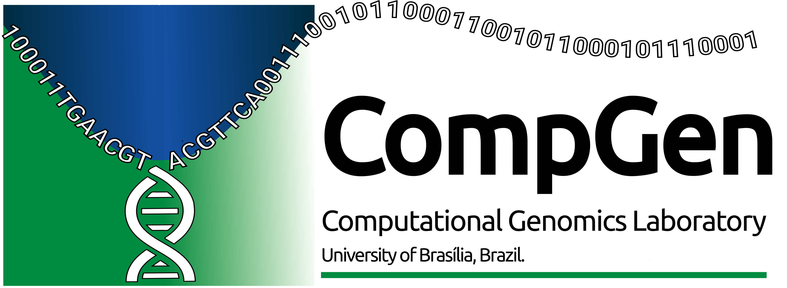

[](https://doi.org/10.5281/zenodo.3445485)
[](https://github.com/fmalmeida/mpgap/releases)
[](https://mpgap.readthedocs.io/en/latest/?badge=latest)
[](https://hub.docker.com/r/fmalmeida/mpgap)
[](https://www.nextflow.io/)
[](https://docs.conda.io/en/latest/)
[](https://www.docker.com/)
[](https://sylabs.io/docs/)
[](https://twitter.com/fmarquesalmeida)
[](https://github.com/fmalmeida/mpgap/blob/master/LICENSE)

<p align="center">

  <h1 align="center">MpGAP pipeline</h2>

  <p align="center">
    <h3 align="center">A generic multi-platform genome assembly pipeline</h3>
    <br />
    <a href="https://mpgap.readthedocs.io/en/latest/index.html"><strong>See the documentation »</strong></a>
    <br />
    <br />
    <a href="https://github.com/fmalmeida/MpGAP/issues">Report Bug</a>
    ·
    <a href="https://github.com/fmalmeida/MpGAP/issues">Request Feature</a>
  </p>
</p>

## About

MpGAP is built using [Nextflow](https://www.nextflow.io), a workflow tool to run tasks across multiple compute infrastructures in a very portable manner. It uses Docker/Singularity containers making installation trivial and results highly reproducible. It is an easy to use pipeline that adopts well known software for _de novo_ genome assembly of Illumina, Pacbio and Oxford Nanopore sequencing data through illumina only, long reads only or hybrid modes.

This pipeline wraps up the following software:

|| **Source** |
|:- | :- |
| **Assemblers** | [Canu](https://github.com/marbl/canu), [Flye](https://github.com/fenderglass/Flye), [Raven](https://github.com/lbcb-sci/raven), [Shasta](https://github.com/chanzuckerberg/shasta), [wtdbg2](https://github.com/ruanjue/wtdbg2), [Haslr](https://github.com/vpc-ccg/haslr), [Unicycler](https://github.com/rrwick/Unicycler), [Spades](https://github.com/ablab/spades), [Shovill](https://github.com/tseemann/shovill) |
| **Polishers** | [Nanopolish](https://github.com/jts/nanopolish), [Medaka](https://github.com/nanoporetech/medaka), [gcpp](https://github.com/PacificBiosciences/gcpp), [Pilon](https://github.com/broadinstitute/pilon) |
| **Quality check** | [QUAST](https://github.com/ablab/quast), [MultiQC](https://multiqc.info/) |

### Release notes

Are you curious about changes between releases? See the [changelog](markdown/CHANGELOG.md).

* I **strongly**, **vividly**, **mightily** recommend the usage of the latest versions hosted in master branch, which is nextflow's default.
    + The latest will always have support, bug fixes and generally maitain the same processes (I mainly add things instead of removing) that also were in previous versions.
    + But, if you **really** want to execute an earlier release, please [see the instructions for that](markdown/earlier_releases_instructions.md).
* Versions below 2.0 are no longer supported.

### Further reading

This pipeline has two complementary pipelines (also written in nextflow) for [NGS preprocessing](https://github.com/fmalmeida/mpgap) and [prokaryotic genome annotation](https://github.com/fmalmeida/bacannot) that can give the user a complete workflow for bacterial genomics analyses.

### Feedback

In the pipeline we always try to create a workflow and a execution dynamics that is the most generic possible and is suited for the most possible use cases.

Therefore, feedbacks are very well welcomed. If you believe that your use case is not encompassed in the pipeline, you have enhancement ideas or found a bug, please do not hesitate to [open an issue](https://github.com/fmalmeida/MpGAP/issues/new/choose) to disscuss about it.

## Installation
1. Install Nextflow:
    
    ```bash
    curl -s https://get.nextflow.io | bash
    ```
    
2. Give it a try:
    
    ```bash
    nextflow run fmalmeida/mpgap --help
    ```

3. Download required tools

    * for docker

        ```bash
        # for docker
        docker pull fmalmeida/mpgap:v3.1
        ```

    * for singularity

        ```bash
        # for singularity
        # remember to properly set NXF_SINGULARITY_LIBRARYDIR
        # read more at https://www.nextflow.io/docs/latest/singularity.html#singularity-docker-hub
        export NXF_SINGULARITY_LIBRARYDIR=MY_SINGULARITY_IMAGES
        singularity pull --dir MY_SINGULARITY_IMAGES docker://fmalmeida/mpgap:v3.1
        ```
    
    * for conda
    
        ```bash
        # for conda
        # it is better to create envs with mamba for faster solving
        wget https://github.com/fmalmeida/mpgap/raw/master/environment.yml
        conda env create -f environment.yml   # advice: use mamba

        ## if using conda you must download the busco dbs for quast to properly run the assembly quality check step
        ## download busco dbs
        ## CONDA_PREFIX is the base/root directory of your conda installation
        mkdir -p $CONDA_PREFIX/envs/mpgap-3.1/lib/python3.6/site-packages/quast_libs/busco/
        ### bacteria db
        wget -O $CONDA_PREFIX/envs/mpgap-3.1/lib/python3.6/site-packages/quast_libs/busco/bacteria.tar.gz https://busco.ezlab.org/v2/datasets/bacteria_odb9.tar.gz
        ### eukaryota db
        wget -O $CONDA_PREFIX/envs/mpgap-3.1/lib/python3.6/site-packages/quast_libs/busco/eukaryota.tar.gz https://busco.ezlab.org/v2/datasets/eukaryota_odb9.tar.gz
        ### fungi db
        wget -O $CONDA_PREFIX/envs/mpgap-3.1/lib/python3.6/site-packages/quast_libs/busco/fungi.tar.gz https://busco.ezlab.org/v2/datasets/fungi_odb9.tar.gz
        ```
    
4. Start running your analysis
    
    ```bash
    nextflow run fmalmeida/mpgap -profile <docker/singularity/conda>
    ```

:fire: Please read the documentation below on [selecting between conda, docker or singularity](https://github.com/fmalmeida/mpgap/tree/master#selecting-between-profiles) profiles, since the tools will be made available differently depending on the profile desired.

## Documentation

### Selecting between profiles

Nextflow profiles are a set of "sensible defaults" for the resource requirements of each of the steps in the workflow, that can be enabled with the command line flag `-profile`. You can learn more about nextflow profiles at:

+ https://nf-co.re/usage/configuration#basic-configuration-profiles
+ https://www.nextflow.io/docs/latest/config.html#config-profiles

The pipeline have "standard profiles" set to run the workflows with either conda, docker or singularity using the [local executor](https://www.nextflow.io/docs/latest/executor.html), which is nextflow's default and basically runs the pipeline processes in the computer where Nextflow is launched. If you need to run the pipeline using another executor such as sge, lsf, slurm, etc. you can take a look at [nextflow's manual page](https://www.nextflow.io/docs/latest/executor.html) to proper configure one in a new custom profile set in your personal copy of [ngs-preprocess config file](https://github.com/fmalmeida/mpgap/blob/master/nextflow.config) and take advantage that nextflow allows multiple profiles to be used at once, e.g. `-profile conda,sge`.

By default, if no profile is chosen, the pipeline will "load the docker profile". Available pre-set profiles for this pipeline are: docker, conda, singularity, you can choose between them as follows:

* conda

    ```bash
    nextflow run fmalmeida/mpgap -profile conda [options]
    ```

* docker
    
    ```bash
    nextflow run fmalmeida/mpgap -profile docker [options]
    ```

* singularity
    
    ```bash
    nextflow run fmalmeida/mpgap -profile singularity [options]
    ```

#### Note on conda

:book: Please use conda as last resource

The usage of conda profile will **only** work in linux-64 machine because some of the tools only have its binaries available for this machine, and others had to be put inside the "bin" dir to avoid version compatibility also were compiled for linux-64. A few examples are: wtdbg2, ALE (used as auxiliary tool in pilon polish step), spades v3.13 for unicycler, and others.

Therefore, be aware, `-profile conda` will only work on linu-64 machines. Users in orther systems must use it with docker or singularity.

Finally, the main conda packages in the `environment.yml` file have been "frozen" to specific versions to make env solving faster. If you saw that I tool has a new update and would like to see it updated in the pipeline, please flag an issue.

Also, if using conda you must download the busco dbs for quast to properly run the assembly quality check step.

> `CONDA_PREFIX` is the base/root directory of your conda installation

```bash
mkdir -p $CONDA_PREFIX/envs/mpgap-3.1/lib/python3.6/site-packages/quast_libs/busco/
wget -O $CONDA_PREFIX/envs/mpgap-3.1/lib/python3.6/site-packages/quast_libs/busco/bacteria.tar.gz https://busco.ezlab.org/v2/datasets/bacteria_odb9.tar.gz
wget -O $CONDA_PREFIX/envs/mpgap-3.1/lib/python3.6/site-packages/quast_libs/busco/eukaryota.tar.gz https://busco.ezlab.org/v2/datasets/eukaryota_odb9.tar.gz
wget -O $CONDA_PREFIX/envs/mpgap-3.1/lib/python3.6/site-packages/quast_libs/busco/fungi.tar.gz https://busco.ezlab.org/v2/datasets/fungi_odb9.tar.gz
chmod -R 777 $CONDA_PREFIX/envs/mpgap-3.1/lib/python3.6/site-packages/quast_libs/busco
```

### Explanation of hybrid strategies

Hybrid assemblies can be produced with two available strategies. Please read more about the strategies and how to set them up in the [online documentation](https://mpgap.readthedocs.io/en/latest/manual.html#hybrid-assembly-strategies).

:arrow_right: they are chosen with the parameter `--hybrid_strategy`.

#### Strategy 1

It uses the hybrid assembly modes from Unicycler, Haslr and/or SPAdes.

#### Strategy 2

It produces a long reads only assembly and polishes (correct errors) it with short reads using Pilon.

> If polishing with Illumina paired end reads pilon will be executed with [Unicycler-polish program](https://github.com/rrwick/Unicycler/blob/main/docs/unicycler-polish.md), taking advantage of its ability to perform multiple rounds of polishing until changes are minimal.

#### Example:

```bash
# run the pipeline setting the desired hybrid strategy globally (for all samples)
nextflow run fmalmeida/mpgap \
  --output output \
  --threads 5 \
  --input "samplesheet.yml" \
  --hybrid_strategy "both"
```

:fire: This will perform, for **all** samples, both both strategy 1 and strategy 2 hybrid assemblies. Please read more about it in the [manual reference page](https://mpgap.readthedocs.io/en/latest/manual.html) and [samplesheet reference page](https://mpgap.readthedocs.io/en/latest/samplesheet.html).

### Usage

For understading pipeline usage and configuration, users must read the <a href="https://mpgap.readthedocs.io/en/latest/index.html"><strong>complete online documentation »</strong></a>

### Using the configuration file

All parameters showed above can be, and are advised to be, set through the configuration file. When a configuration file is used the pipeline is executed as `nextflow run fmalmeida/mpgap -c ./configuration-file`. Your configuration file is what will tell the pipeline which type of data you have, and which processes to execute. Therefore, it needs to be correctly configured.

* To create a configuration file in your working directory:
  
      nextflow run fmalmeida/mpgap --get_config

### Interactive graphical configuration and execution

#### Via NF tower launchpad (good for cloud env execution)

Nextflow has an awesome feature called [NF tower](https://tower.nf). It allows that users quickly customise and set-up the execution and configuration of cloud enviroments to execute any nextflow pipeline from nf-core, github (this one included), bitbucket, etc. By having a compliant JSON schema for pipeline configuration it means that the configuration of parameters in NF tower will be easier because the system will render an input form.

Checkout more about this feature at: https://seqera.io/blog/orgs-and-launchpad/

<p align="center">

</p>

#### Via nf-core launch (good for local execution)

Users can trigger a graphical and interactive pipeline configuration and execution by using [nf-core launch](https://nf-co.re/launch) utility. nf-core launch will start an interactive form in your web browser or command line so you can configure the pipeline step by step and start the execution of the pipeline in the end.

```bash
# Install nf-core
pip install nf-core

# Launch the pipeline
nf-core launch fmalmeida/mpgap
```

It will result in the following:

<p align="center">

</p>

<p align="center">

</p>

## Known issues

1. Whenever using unicycler with unpaired reads, an odd platform-specific SPAdes-related crash seems do randomly happen as it can be seen in the issue discussed at https://github.com/rrwick/Unicycler/issues/188.
  + As a workaround, Ryan says to use the `--no_correct` parameter which solves the issue and does not have a negative impact on assembly quality.
  + Therefore, if you run into this error when using unpaired data you can activate this workaroud with:
    + `--unicycler_additional_parameters " --no_correct "`.
2. Sometimes, shovill assembler can fail and cause the pipeline to fail due to problems in estimating the genome size. This, is actually super simple to solve! Instead of letting the shovill assembler estimate the genome size, you can pass the information to it and prevent its fail:
    + `--shovill_additional_parameters " --gsize 3m "`

## Citation

To cite this pipeline users can use our Zenodo tag or directly via the github url. Users are encouraged to cite the programs used in this pipeline whenever they are used.

Please, do not forget to cite the software that were used whenever you use its outputs. See [the list of tools](markdown/list_of_tools.md).
