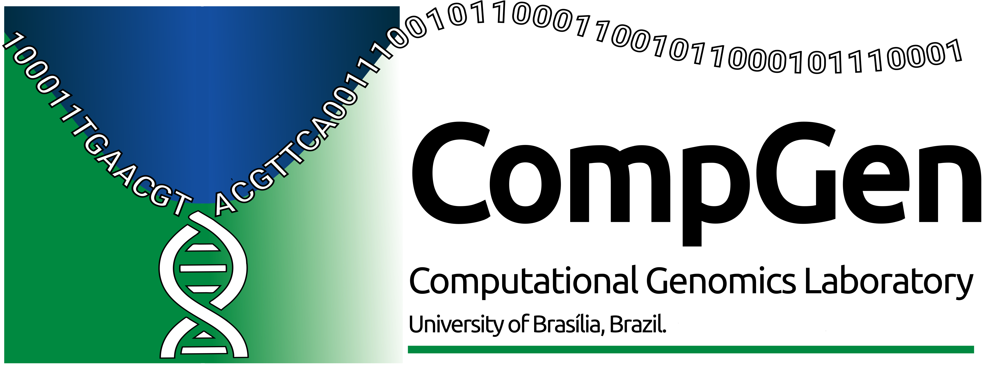

.. _index:

----

*****
MpGAP
*****

`MpGAP <https://github.com/fmalmeida/mpgap>`_ is a pipeline developed with `Nextflow <https://www.nextflow.io/docs/latest/index.html>`_ and `Docker <https://www.docker.com/>`_. It was designed to provide an easy-to-use framework for genome assembly of Illumina, Pacbio and Oxford Nanopore sequencing data through illumina only, long reads only or hybrid modes.

It wraps up the following tools:

.. list-table::
   :widths: 200 200
   :header-rows: 1

   * - Analysis steps
     - Used software

   * - Long reads assembly
     - `Canu <https://github.com/marbl/canu>`_, `Flye <https://github.com/fenderglass/Flye>`_, `Unicycler <https://github.com/rrwick/Unicycler>`_, `Raven <https://github.com/lbcb-sci/raven>`_, `Shasta <https://github.com/chanzuckerberg/shasta>`_ and `wtdbg2 <https://github.com/ruanjue/wtdbg2>`_

   * - Hybrid assembly
     - `Haslr <https://github.com/vpc-ccg/haslr>`_, `Unicycler <https://github.com/rrwick/Unicycler>`_ and `SPAdes <https://github.com/ablab/spades>`_

   * - Short reads assembly
     - `Shovill <https://github.com/tseemann/shovill>`_, `Unicycler <https://github.com/rrwick/Unicycler>`_ and `SPAdes <https://github.com/ablab/spades>`_

   * - Assembly polishing
     - `Nanopolish <https://github.com/jts/nanopolish>`_, `Medaka <https://github.com/nanoporetech/medaka>`_, `gcpp <https://github.com/PacificBiosciences/gcpp>`_ and `Pilon <https://github.com/broadinstitute/pilon>`_

   * - Assembly QC
     - `Quast <https://github.com/ablab/quast>`_ and `MultiQC <https://multiqc.info/>`_

.. toctree::
   :hidden:

   installation
   quickstart
   manual
   config
   examples

Support Contact
===============
Whenever a doubt arise feel free to contact me at almeidafmarques@gmail.com
